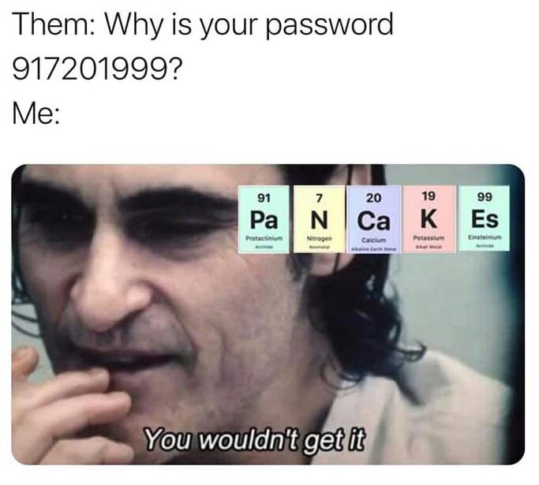

# ElementWords

## Table of Contents

1. [About The Project](#about-the-project)
   - [Built With](#built-with)
2. [Disclaimer](#disclaimer)

## About The Project

I saw this meme on reddit and wanted to know if there are more words like pancakes that can be written using chemical elements.

So I checked a list of about 372k English Words and a list of 18k Names to find my answer.
### Built With

* [Python 3.9](www.python.org)

## Disclaimer

I know this table is great for rainbow attacks.

But please only use it for ethical hacking. Only use this if you have permission from the owner of the target you are hacking.

Since this is the internet and a simple disclaimer won't stop hackers using my code or lists, I won't take any claim for damages etc. as mentioned in the license.
